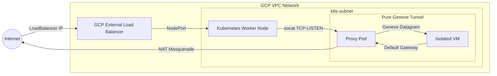

# Scratchpad Example: Kubernetes Managed Isolated VM over Geneve Tunnel

This project is a scratchpad to explore integrating isolated Google Compute Engine (GCE) virtual machines into a Kubernetes cluster using a **Geneve Overlay Tunnel**.

## Security Architecture Note

> [!IMPORTANT]
> This implementation utilizes a pure L3 Geneve overlay tunnel without network-layer encryption (no IPsec or mTLS). Packets traversing between the Kubernetes worker node and the isolated virtual machines are transmitted as-is (unencrypted). All payload datagrams must be secured end-to-end at the application layer (e.g., using HTTPS, SSH, or application-native TLS).

## Architecture

The repository has two independent Terraform workspaces to cleanly isolate the lifecycle of the base Kubernetes infrastructure from the proxied virtual machines:

### Workspaces:

1. **`tf/01-base-cluster/`**:
   - Manages core networking (VPC, firewalls, internal subnets).
   - Provisions the control plane and worker nodes.
   - Configures local `outputs.tf` to export necessary networking state.

2. **`tf/02-proxied-vms/`**:
   - Ingests variables from the base workspace via `terraform_remote_state`.
   - Generates an infrastructure-managed SSH key and micro-VM instances statelessly.
   - Deploys proxy pods and isolated VMs to tunnel inbound payload traffic directly across the cluster over the overlay network.

---

## Traffic Flow and Network Architecture

The following diagram illustrates how the isolated virtual machine integrates into the Kubernetes cluster via a Geneve overlay tunnel, routing both external ingress and direct egress entirely through the proxy pod on the worker node:



### Networking Components Breakdown

- **Isolated VM Layer**: Configured directly with a Geneve overlay interface utilizing the proxy pod as a transparent gateway.
- **Kubernetes Proxy Layer**: Configured with `hostNetwork: true` to bind incoming node requests and route payload traffic across the established overlay tunnel to the micro-VM.
- **Egress Masquerading**: All external requests originating from the VM default to utilizing the proxy pod's Geneve gateway interface, ensuring outbound calls correctly translate to the cluster's public egress address.

---

## Getting Started

Deploying the complete environment follows a sequenced application workflow:

### 1. Provision the Base Cluster

First setup some variables in a `terraform.tfvars` file or via params. You can see the available params in `variables.tf`. 

> Note that because we dont do any air traffic control of node ports and vms, you need to ensure that you do not re-use any ports across your `proxied_vms` values. The default shows two vms getting built with two and one different port being exposed respectively.

```bash
cd tf/01-base-cluster

cat <<EOF > terraform.tfvars
gcp_project = "your-gcp-project-id"
EOF
```

Initialize and apply the core infrastructure first:

```bash
terraform init
terraform apply

export KUBECONFIG=$(terraform output -raw kubeconfig_path)
```

### 2. Provision the Application Layer (Proxied VMs)

Deploy the unique application micro-VMs secured with mTLS:

```bash
cd ../02-proxied-vms

# Uses the same project ID from the base configuration

terraform init
terraform apply
```

### 3. Test Connectivity

Find your LoadBalancer public endpoints and confirm traffic securely traverses the tunnel:

```bash
# using the KUBECONFIG set above

# Dynamically fetch all LoadBalancer IPs and their associated ports, then curl each endpoint automatically:
kubectl get svc -o json | jq -r '
  .items[] | 
  select(.spec.type == "LoadBalancer") | 
  .status.loadBalancer.ingress[0].ip as $ip | 
  select($ip != null) | 
  .spec.ports[] | 
  "\($ip):\(.port)"
' | while read -r endpoint; do
  echo "Testing endpoint: http://${endpoint}"
  curl -s -S --connect-timeout 5 "http://${endpoint}" | jq .
done
```

One heads-up: the kubeconfig uses a short lived token. You might need to refresh it by running `terraform apply; export KUBECONFIG=$(terraform output -raw kubeconfig_path)` in the `tf/01-base-cluster` directory. 

