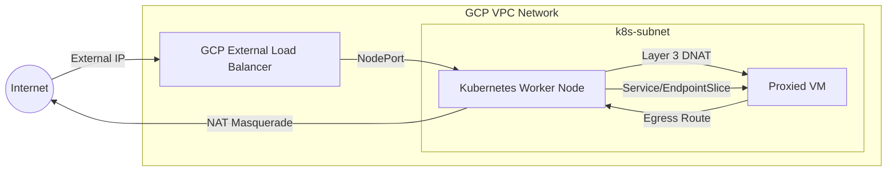

# Scratchpad Example to Explore a K8s managed isolated VM

This project is a scratchpad to explore a K8s managed isolated VM. It is not intended for production use. 

The idea is that you can use K8s to manage ingress and egress for a VM that is not part of the cluster. Currently we manage this VM via terraform along with the lifecycle of the cluster itself, but it is not a stretch to imagine that we could manage this VM via a K8s operator.


## Architecture

In the example, we call this VM a "proxied VM" because it is proxied to the cluster via native Layer 3 routing. Ingress to it comes only via a Kubernetes LoadBalancer service; all egress is routed via GCP networking to the a node.

- **Inbound (Ingress)**: Kubernetes LoadBalancer Service -> GCP External Load Balancer -> K8s EndpointSlice -> Proxied VM (Layer 3 IP Routing)
- **Outbound (Egress)**: Transparent Layer 3 VPC Routing (VM -> Worker Node NAT -> Internet)

### VM Isolation and Traffic Flow

The following diagram illustrates how the Proxied VM is isolated within the VPC and how all edge traffic is funneled through the Kubernetes node:



### Layer 3 VPC Routing Architecture Components

- **Proxied VM**: Tagged with a specific via-node tag, runs standard applications. No proxy environment variables are needed.
- **GCP VPC Static Route**: Points `0.0.0.0/0` (internet egress) from tagged instances to the Worker Node as the next hop.
- **Kubernetes Worker Node**: Acting as a transparent NAT gateway using standard `iptables` MASQUERADE rules.
- **Kubernetes Service & EndpointSlice**: Routes cluster-internal or NodePort traffic directly to the VM's private IP.

## Getting Started

Follow these steps to deploy and test the infrastructure.

### 1. Provision Infrastructure

Apply the Terraform configuration to provision the GCP VMs (Control Plane, Worker, and Proxied VM) and generate the Kubernetes manifests.

```bash
cat <<EOF > terraform.tfvars
# this is the only required variable
gcp_project = "project-name"
# override other variables here too
EOF

terraform init
terraform apply
```

### 2. Deploy Service and EndpointSlice

Once the cluster is up and running, extract the Control Plane IP and fetch the `kubeconfig` to your local `.tmp` directory to interact with the cluster. *Note: The `terraform apply` step will generate `.tmp/proxy-svc.yaml` containing the K8s manifests configured with the VM's static IP.*

```bash
export CP_IP=$(terraform output -raw control_plane_public_ip)
export SSH_KEY=$(terraform output -raw ssh_key_path)
export KUBECONFIG="$(pwd)/.tmp/kubeconfig.yaml"

export SSH_OPTS="-o StrictHostKeyChecking=no -o UserKnownHostsFile=/dev/null -i ${SSH_KEY}"


# check the startup script on the control plane
ssh ${SSH_OPTS} admin@${CP_IP} "sudo journalctl -u google-startup-scripts.service -f"
# hit ctrl-c to break out when you see: google-startup-scripts.service: Consumed ...

# then get a kubeconfig for the host:
ssh ${SSH_OPTS} admin@${CP_IP} "sudo cat /etc/kubernetes/admin.conf" > ${KUBECONFIG}

# now deploy our service and endpoints to proxy to the vm
kubectl apply -f .tmp/proxy-svc.yaml
```

### 3. Verify the Deployment

Verify that the `proxied-svc` is created with type `LoadBalancer` and wait for it to get an `EXTERNAL-IP` (this may take a minute as GCP provisions the load balancer):

```bash
kubectl get svc proxied-svc -w
```

Expect output similar to:
```
NAME          TYPE           CLUSTER-IP       EXTERNAL-IP     PORT(S)        AGE
proxied-svc   LoadBalancer   10.101.149.154   35.188.141.185   80:31234/TCP   1m
```

Also verify endpoints point to the VM IP:
```bash
kubectl get endpoints proxied-svc
```

### 4. Test the Bridge (Layer 3 Ingress & Egress)

The `e2-micro` VM is running an inline Python script that serves HTTP requests on port `80`. When it receives a request, it synchronously tests direct internet egress by calling `httpbin.org/ip`.

Now that we have a LoadBalancer, you can test it directly from outside the cluster (e.g., from your local machine if firewalls allow, or from the control plane node):

```bash
export EXTERNAL_IP=$(kubectl get svc proxied-svc -o jsonpath='{.status.loadBalancer.ingress[0].ip}')
curl http://$EXTERNAL_IP
```

**Expected output:**
A successful JSON response indicating the Python script on the VM received your request AND successfully hits `httpbin.org/ip` transparently via Layer 3 routing!

```json
{"message": "Successfully hit httpbin via direct L3 routing", "origin_ip": "WORKER_PUBLIC_IP", "httpbin_status": 200}
```
