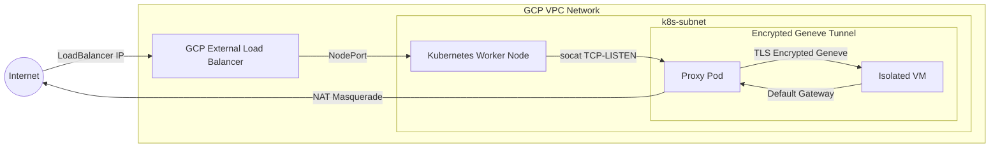

# Scratchpad Example: Kubernetes Managed Isolated VM over mTLS Geneve Tunnel

This project is a scratchpad to explore integrating isolated Google Compute Engine (GCE) virtual machines into a Kubernetes cluster using a **Geneve Overlay Tunnel** secured entirely with **mutual TLS (mTLS)**.

## Architecture

The repository has two independent Terraform workspaces to cleanly isolate the lifecycle of the base Kubernetes infrastructure from the proxied virtual machines:

### Workspaces:

1. **`tf/01-base-cluster/`**:
   - Manages core networking (VPC, firewalls, internal subnets).
   - Provisions the control plane and worker nodes.
   - Configures local `outputs.tf` to export necessary networking state.

2. **`tf/02-proxied-vms/`**:
   - Ingests variables from the base workspace via `terraform_remote_state`.
   - Generates an infrastructure-managed CA and unique client/server certificates using the `tls` provider (statelessly).
   - Deploys proxy pods and isolated VMs to tunnel inbound payload traffic directly across the cluster over encrypted sockets.

---

## Traffic Flow and Network Architecture

The following diagram illustrates how the isolated virtual machine integrates into the Kubernetes cluster via an TLS-encrypted Geneve overlay tunnel, routing both external ingress and direct egress entirely through the proxy pod on the worker node:



### Networking Components Breakdown

- **Isolated VM Layer**: Runs a transparent IPsec transport mode configuration integrated directly with a Geneve overlay interface. 
- **X.509 Certificate Authentication**: Both the Proxied VM and the Kubernetes Proxy Pod exclusively authenticate endpoints using statelessly generated mutual TLS (mTLS) X.509 certificates, securely managed and rotated directly by the Terraform `tls` provider framework.
- **Kubernetes Proxy Layer**: Configured with `hostNetwork: true` to bind incoming node requests and transparently route payload traffic across the established overlay tunnel to the micro-VM.
- **Egress Masquerading**: All external requests originating from the VM default to utilizing the proxy pod's Geneve gateway interface, ensuring outbound calls correctly translate to the cluster's public egress address.

---

## Getting Started

Deploying the complete environment follows a sequenced application workflow:

### 1. Provision the Base Cluster

First setup some variables in a `terraform.tfvars` file or via params. You can see the available params in `variables.tf`. 

> Note that because we dont do any air traffic control of node ports and vms, you need to ensure that you do not re-use any ports across your `proxied_vms` values. The default shows two vms getting built with two and one different port being exposed respectively.

```bash
cd tf/01-base-cluster

cat <<EOF > terraform.tfvars
gcp_project = "your-gcp-project-id"
EOF
```

Initialize and apply the core infrastructure first:

```bash
terraform init
terraform apply

export KUBECONFIG=$(terraform output -raw kubeconfig_path)
```

### 2. Provision the Application Layer (Proxied VMs)

Deploy the unique application micro-VMs secured with mTLS:

```bash
cd ../02-proxied-vms

# Uses the same project ID from the base configuration

terraform init
terraform apply
```

### 3. Test Connectivity

Find your LoadBalancer public endpoints and confirm traffic securely traverses the tunnel:

```bash
# using the KUBECONFIG set above in tf/01-base-cluster 
kubectl get svc
```
# use the external IP and ports from the service output corresponding
# to the proxied_vms variable in tf/02-proxied-vms
curl http://<EXTERNAL-IP>
```
