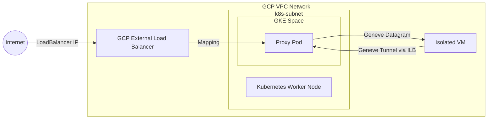
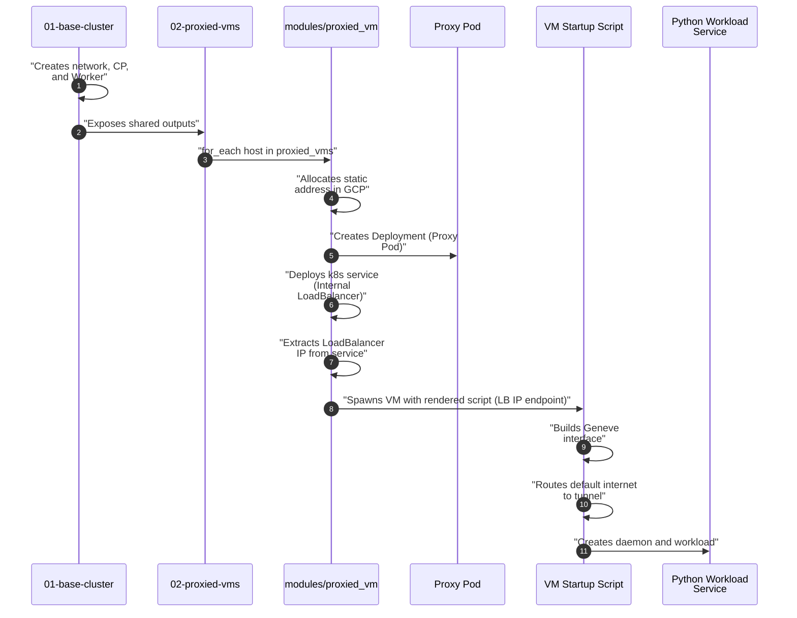
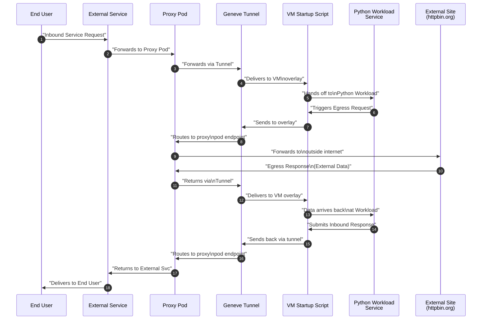

# Scratchpad Example: Kubernetes Managed Isolated VM over Geneve Tunnel

This project is a scratchpad to explore integrating isolated Google Compute Engine (GCE) virtual machines into a Kubernetes cluster using a **Geneve Overlay Tunnel**.

## Security Architecture Note

> [!IMPORTANT]
> This implementation utilizes a pure L3 Geneve overlay tunnel without network-layer encryption (no IPsec or mTLS). Packets traversing between the Kubernetes worker node and the isolated virtual machines are transmitted as-is (unencrypted). All payload datagrams must be secured end-to-end at the application layer (e.g., using HTTPS, SSH, or application-native TLS).

## Architecture

The repository has multiple independent Terraform workspaces to delineate separate concerns in the project:

### Workspaces:

1. **`tf/01-base-cluster/`**:
   - Manages core networking (VPC, firewalls, internal subnets) and required GCP services for it.
   - Provisions the control plane and worker nodes.
   - Configures local `outputs.tf` to export necessary networking state.

2. **`tf/02-tunnel-image/`**:
   - Creates the Artifact Registry and enables its requried API services.
   - Builds and pushes a Docker image for proxy pod using community Docker provider. 
   - Image sets up the tunnel from the pod side and routes traffic to it.

3. **`tf/03-proxied-vms/`**:
   - Ingests variables from base cluster and image path from state.
   - Configured via a single `proxied_ports` variable which maps isolated vms to the ports they expose. Defaults to 2 vms with 1 and 2 ports, respectively.
   - Generates proxy workers based on proxied_ports -- allocates a VM runner and pod which pulls the custom image built in `tf/02-tunnel-image/`

---

## Traffic Flow and Network Architecture

The following diagram illustrates at a high level how the isolated virtual machine integrates into the Kubernetes cluster via a Geneve overlay tunnel, routing both external ingress and direct egress entirely through the proxy pod on the worker node:



## Detailed Execution and Request Flows

### 1. Terraform Apply Sequence

The following illustrates the sequence of resources being created during a `terraform apply`.  It focuses on project `02-proxied-vms` and the resources it creates because `01-base-cluster` is a straightforward setup of a VPC, subnetwork, and self managed k8s cluster.



### 2. Life of a Request

The following shows the flow of data during an end user request of the proxied service and the return of the response.



### Exposed Outputs from `01-base-cluster`
The following important variables are read by `02-proxied-vms` via the remote state:
- `network_id`: The ID of the VPC network.
- `subnetwork_id`: The ID of the regional subnetwork.
- `worker_node_ip`: Internal IP of the k8s node.
- `vm_ssh_public_key`: SSH authorized key.
- `control_plane_public_ip`: Native IP for CP connections.
- `kubeconfig_path`: Absolute path to downloaded config.
- `rand_suffix`: Used to generate clean names.


## Getting Started

Deploying the complete environment follows a sequenced application workflow:

### 1. Provision the Base Cluster

First setup some variables in a `terraform.tfvars` file or via params. You can see the available params in `variables.tf`. The variable that does not have a default is `gcp_project`.


```bash
cd tf/01-base-cluster

cat <<EOF > terraform.tfvars
gcp_project = "your-gcp-project-id"
EOF
```

Initialize and apply the core infrastructure first:

```bash
terraform init
terraform apply

export KUBECONFIG=$(terraform output -raw kubeconfig_path)
```

### 2. Provision the Tunnel Image

Provision the registry and build the proxy image. Note that the Docker provider is now configured to handle authentication automatically via Google access tokens, reducing manual setup. If manual configuration is preferred or needed, you can use:

```bash
cd ../02-tunnel-image

terraform init
terraform apply
```


### 3. Provision the Application Layer (Proxied VMs)

Deploy the unique application micro-VMs:

```bash
cd ../03-proxied-vms

# Uses the same project ID from the base configuration

terraform init
terraform apply
```

### 3. Test Connectivity

Find your LoadBalancer public endpoints and confirm traffic securely traverses the tunnel:

```bash
# using the KUBECONFIG set above

# Dynamically fetch all LoadBalancer IPs and their associated ports, then curl each:
export ENDPOINTS=$(kubectl get svc -o json | jq -r '.items[] | select(.spec.type=="LoadBalancer") | 
  (.status.loadBalancer.ingress[].ip // empty) as $ip | "\($ip):\(.spec.ports[].port)"')
for endpoint in ${ENDPOINTS}; do
  echo "Testing endpoint: http://${endpoint}"
  curl -s -S --connect-timeout 5 "http://${endpoint}" | jq .
done

# the service will default to httpbin.org, but you can pass in a different target via the url param
curl -s -S --connect-timeout 5 "http://${endpoint}?url=https://google.com" | jq .

```

### Next Steps

* TODO figure out a way to regenerate the kubeconfig whenever the CP is recreated but not more often than that
* TODO combine outputs maybe so there are fewer things e.g. subnet id and name and tighten variable definition formats
* TODO Verify cloud controller manager yaml needs the subnet if an ILB has the subnet defined the right way with the short name not id.
* TODO let's avoid using "latest" for the image and instead share the path with the hash in the 02 project output
* TODO have our python workload handle a missing URI and default to the same thing as /
* TODO have the proxy pod chattier in the log
