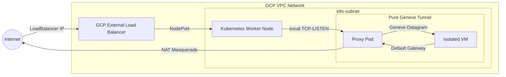
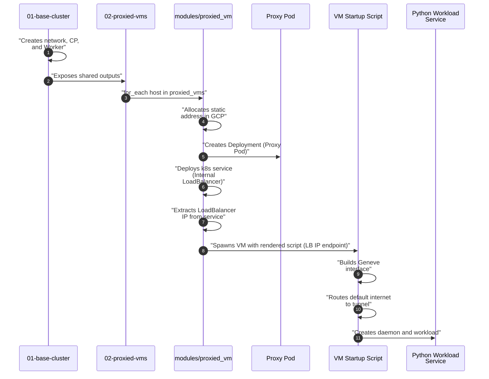
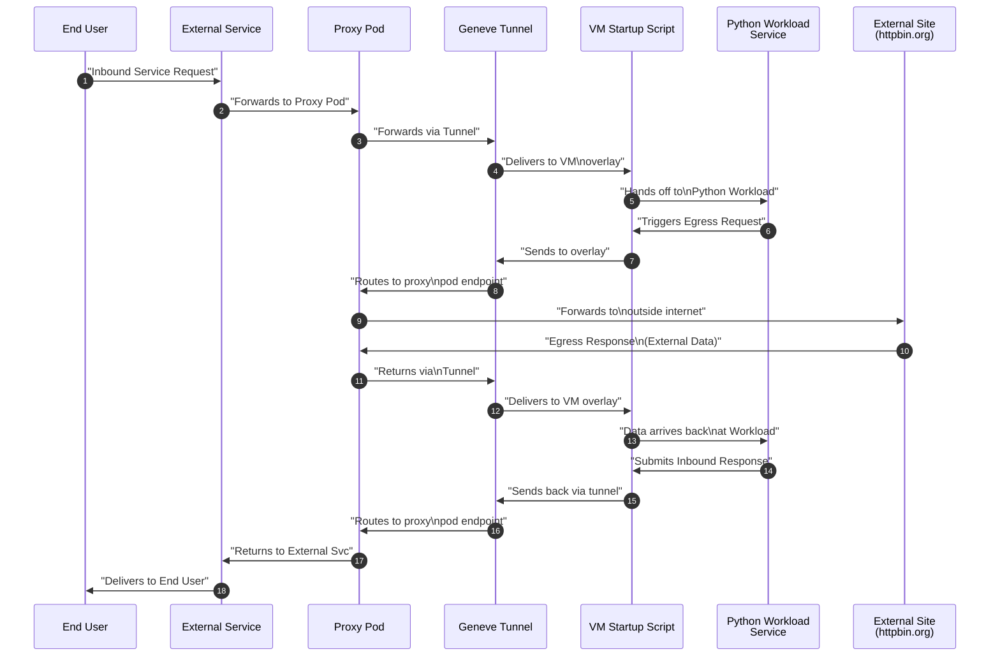

# Scratchpad Example: Kubernetes Managed Isolated VM over Geneve Tunnel

This project is a scratchpad to explore integrating isolated Google Compute Engine (GCE) virtual machines into a Kubernetes cluster using a **Geneve Overlay Tunnel**.

## Security Architecture Note

> [!IMPORTANT]
> This implementation utilizes a pure L3 Geneve overlay tunnel without network-layer encryption (no IPsec or mTLS). Packets traversing between the Kubernetes worker node and the isolated virtual machines are transmitted as-is (unencrypted). All payload datagrams must be secured end-to-end at the application layer (e.g., using HTTPS, SSH, or application-native TLS).

## Architecture

The repository has two independent Terraform workspaces to cleanly isolate the lifecycle of the base Kubernetes infrastructure from the proxied virtual machines:

### Workspaces:

1. **`tf/01-base-cluster/`**:
   - Manages core networking (VPC, firewalls, internal subnets).
   - Provisions the control plane and worker nodes.
   - Configures local `outputs.tf` to export necessary networking state.

2. **`tf/02-proxied-vms/`**:
   - Ingests variables from the base workspace via `terraform_remote_state`.
   - Generates proxy workers based on proxied_ports -- allocates a VM runner and pod which tunnels ingress into and egress from it.
   - Exposes the proxied ports from the pods for debugging and via a Kubernetes LoadBalancer service.

---

## Traffic Flow and Network Architecture

The following diagram illustrates how the isolated virtual machine integrates into the Kubernetes cluster via a Geneve overlay tunnel, routing both external ingress and direct egress entirely through the proxy pod on the worker node:



### Networking Components Breakdown

- **Isolated VM Layer**: Configured directly with a Geneve overlay interface utilizing the proxy pod as a transparent gateway.
- **Kubernetes Proxy Layer**: Configured in the pod network to bind incoming requests and route payload traffic across the established overlay tunnel to the VM.
- **Egress Masquerading**: All external requests originating from the VM default to utilizing the proxy pod's Geneve gateway interface, ensuring outbound calls correctly translate to the cluster's public egress address.
---

## Detailed Execution and Request Flows

### 1. Terraform Apply Sequence

The following illustrates the sequence of resources being created during a `terraform apply`.  It focuses on project `02-proxied-vms` and the resources it creates because `01-base-cluster` is a straightforward setup of a VPC, subnetwork, and self managed k8s cluster.



### 2. Life of a Request

The following shows the flow of data during an end user request of the proxied service and the return of the response.



### Exposed Outputs from `01-base-cluster`
The following important variables are read by `02-proxied-vms` via the remote state:
- `network_id`: The ID of the VPC network.
- `subnetwork_id`: The ID of the regional subnetwork.
- `worker_node_ip`: Internal IP of the k8s node.
- `vm_ssh_public_key`: SSH authorized key.
- `control_plane_public_ip`: Native IP for CP connections.
- `kubeconfig_path`: Absolute path to downloaded config.
- `rand_suffix`: Used to generate clean names.


## Getting Started

Deploying the complete environment follows a sequenced application workflow:

### 1. Provision the Base Cluster

First setup some variables in a `terraform.tfvars` file or via params. You can see the available params in `variables.tf`. The variable that does not have a default is `gcp_project`.


```bash
cd tf/01-base-cluster

cat <<EOF > terraform.tfvars
gcp_project = "your-gcp-project-id"
EOF
```

Initialize and apply the core infrastructure first:

```bash
terraform init
terraform apply

export KUBECONFIG=$(terraform output -raw kubeconfig_path)
```

### 2. Provision the Application Layer (Proxied VMs)

Deploy the unique application micro-VMs secured with mTLS:

```bash
cd ../02-proxied-vms

# Uses the same project ID from the base configuration

terraform init
terraform apply
```

### 3. Test Connectivity

Find your LoadBalancer public endpoints and confirm traffic securely traverses the tunnel:

```bash
# using the KUBECONFIG set above

# Dynamically fetch all LoadBalancer IPs and their associated ports, then curl each:
export ENDPOINTS=$(kubectl get svc -o json | jq -r '.items[] | select(.spec.type=="LoadBalancer") | 
  (.status.loadBalancer.ingress[].ip // empty) as $ip | "\($ip):\(.spec.ports[].port)"')
for endpoint in ${ENDPOINTS}; do
  echo "Testing endpoint: http://${endpoint}"
  curl -s -S --connect-timeout 5 "http://${endpoint}" | jq .
done

# the service will default to httpbin.org, but you can pass in a different target via the url param
curl -s -S --connect-timeout 5 "http://${endpoint}?url=https://google.com" | jq .

```

One heads-up: the kubeconfig uses a short lived token. You might need to refresh it by running `terraform apply; export KUBECONFIG=$(terraform output -raw kubeconfig_path)` in the `tf/01-base-cluster` directory. 

<!-- ### 4. Provision and Test Agent Gateway (Egress Governance)

Deploy the Agent Gateway infrastructure to govern egress traffic from the workloads:

```bash
cd ../03-agent-gateway

terraform init
terraform apply
```

To test the gateway, set an environment variable for the Gateway IP:

```bash
export AGENTGW=$(kubectl get gateway -A -o jsonpath='{.items[?(@.metadata.name=="egress-gateway")].status.addresses[0].value}')
```

Using the default policy supply in the local helm chart, verify that traffic to `httpbin.org` is allowed:

```bash
curl http://${AGENTGW}/?url=http://httpbin.org/ip
```
Expected output: Success (200 OK) with proxied response.

Next, verify that traffic to `icanhazip.com` is blocked:

```bash
curl -v "http://${AGENTGW}/?url=http://icanhazip.com"
```
Expected output: Failure (500 Internal Server Error) with `HTTP Error 403: Forbidden`.

 -->

