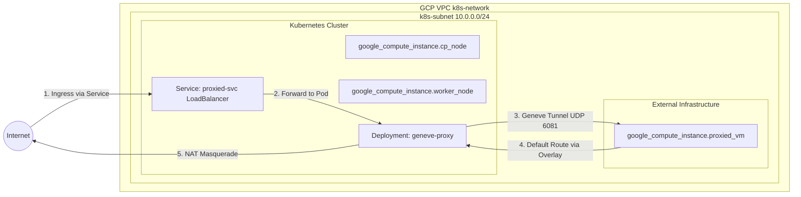

# Scratchpad Example to Explore a K8s managed isolated VM

This project is a scratchpad to explore a K8s managed isolated VM. It is not intended for production use. 

The idea is that you can use K8s to manage ingress and egress for a VM that is not part of the cluster. Currently we manage this VM via terraform along with the lifecycle of the cluster itself, but it is not a stretch to imagine that we could manage this VM via a K8s operator.

## Architecture

In this example, the VM is integrated via a **Geneve Overlay Tunnel** (UDP port 6081). A privileged Proxy Pod sits inside the cluster acting as one end of the tunnel, and the VM acts as the other end. All ingress traffic to the pod routes exclusively through the tunnel to the VM; all egress traffic from the VM traverses the tunnel and exits the cluster via the pod's gateway.

- **Inbound (Ingress)**: Kubernetes LoadBalancer Service -> Proxy Pod -> Geneve Tunnel -> Proxied VM
- **Outbound (Egress)**: Proxied VM -> Geneve Tunnel -> Proxy Pod (NAT Masquerade) -> Internet

### VM Isolation and Traffic Flow

The following diagram illustrates the Geneve Overlay architecture and the integration of all Terraform and Kubernetes components:



### Provisioned Infrastructure Resources

The project sets up the following infrastructure using Terraform and Kubernetes manifests:

#### Compute & Network Resources (Terraform)
- **`google_compute_network.k8s`**: The core VPC network linking the cluster and isolated VM.
- **`google_compute_subnetwork.k8s_subnet`**: The regional subnet providing internal IP address ranges.
- **`google_compute_address.cp_static_ip`**: External static IP address for the Control Plane node.
- **`google_compute_address.proxied_vm_ip`**: Internal static IP for the Proxied VM.
- **`google_compute_firewall.allow_internal_all`**: Opens required internal communication within the VPC subnet.
- **`google_compute_firewall.allow_management`**: Allows administrative SSH/K8s API access.
- **`google_compute_firewall.allow_http`**: Permits external load balancer access via port 80.
- **`google_compute_route.pod_cidr_route`**: Explicit routing for the 192.168.0.0/16 Pod CIDR block via the worker node.
- **`google_compute_instance.cp_node`**: The Kubernetes control plane component.
- **`google_compute_instance.worker_node`**: The Kubernetes worker node hosting the proxy container.
- **`google_compute_instance.proxied_vm`**: The external target VM shielded by the proxy via Geneve overlay routing.

#### Proxy & Networking Components (Kubernetes)
- **`Deployment/geneve-proxy`**: Runs the privileged container terminating Geneve interfaces, handling port forwarding, and managing masqueraded NAT.
- **`Service/proxied-svc`**: Type `LoadBalancer` exposing the proxy endpoints for external client consumption.

## Getting Started

Follow these steps to deploy and test the infrastructure.

### 1. Provision Infrastructure

Apply the Terraform configuration to provision the GCP VMs (Control Plane, Worker, and Proxied VM) and generate the Kubernetes manifests.

```bash
cat <<EOF > terraform.tfvars
# this is the only required variable
gcp_project = "project-name"
# override other variables here too
EOF

terraform init
terraform apply
```

### 2. Deploy Service and EndpointSlice

Once the cluster is up and running, extract the Control Plane IP and fetch the `kubeconfig` to your local `.tmp` directory to interact with the cluster. *Note: The `terraform apply` step will generate `.tmp/proxy-svc.yaml` containing the K8s manifests configured with the VM's static IP.*

```bash
export CP_IP=$(terraform output -raw control_plane_public_ip)
export KUBECONFIG="$(pwd)/.tmp/kubeconfig.yaml"
export SSH_KEY=$(terraform output -raw ssh_key_path)
export SSH_OPTS="-q -o StrictHostKeyChecking=no -o UserKnownHostsFile=/dev/null -i ${SSH_KEY}"

# check the startup script on the control plane
ssh ${SSH_OPTS} admin@${CP_IP} "sudo journalctl -u google-startup-scripts.service -f"
# hit ctrl-c to break out when you see: google-startup-scripts.service: Consumed ...

# then get a kubeconfig for the host:
ssh ${SSH_OPTS} admin@${CP_IP} "sudo cat /etc/kubernetes/admin.conf" > ${KUBECONFIG}

# now deploy our services and endpoints to proxy to the VMs
kubectl apply -f .tmp/manifests/
```

### 3. Verify the Deployment

Verify that the load balancer services are created and wait for them to get an `EXTERNAL-IP` (this may take a minute as GCP provisions the load balancers):

```bash
kubectl get svc
```

Expect output similar to:
```
NAME           TYPE           CLUSTER-IP       EXTERNAL-IP     PORT(S)        AGE
httpbin1-svc   LoadBalancer   10.101.149.154   35.188.141.185   80:31234/TCP   1m
```

### 4. Test the Bridge (Layer 3 Ingress & Egress)

Each `e2-micro` VM is running an inline Python script that serves HTTP requests on its configured ports. When it receives a request, it synchronously tests direct internet egress by calling `httpbin.org/ip`.

Now that we have LoadBalancers, you can test them directly from outside the cluster (e.g., from your local machine if firewalls allow, or from the control plane node):

```bash
export EXTERNAL_IP=$(kubectl get svc httpbin1-svc -o jsonpath='{.status.loadBalancer.ingress[0].ip}')
curl http://${EXTERNAL_IP}

# test other exposed ports configured in the var.proxied_vms map
curl http://${EXTERNAL_IP}:8080
```

**Expected output:**
A successful JSON response indicating the Python script on the VM received your request AND successfully hits `httpbin.org/ip` transparently via Layer 3 routing!

```json
{"message": "Successfully hit httpbin via direct L3 routing", "origin_ip": "WORKER_PUBLIC_IP", "httpbin_status": 200}
```
