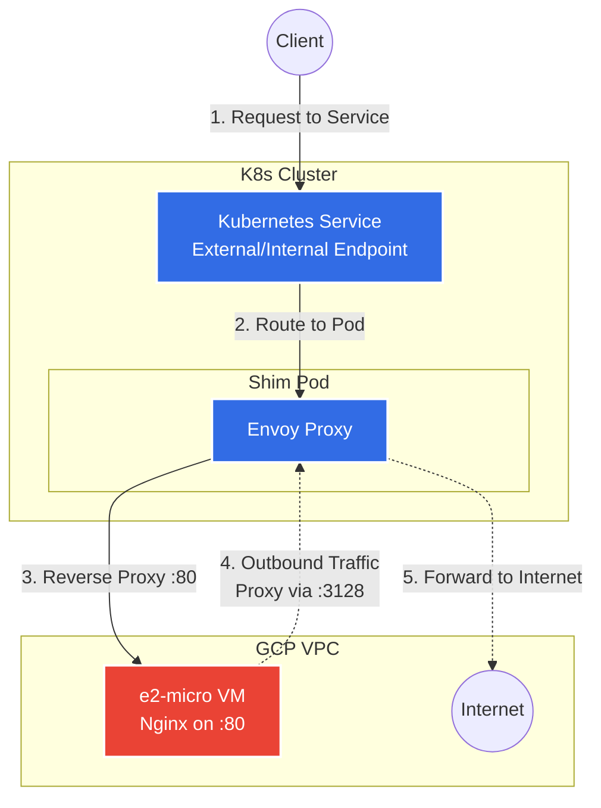

# Shim Pod and VM Bridge Architecture

## Prompt
> i'd like to create a very small e2-micro vm in the same project as this terraform managed infra.  I would like to deploy a shim pod to the cluster which bridges to it (ie hitting the pod ip bridges to the VM. and also back, that is -- any egress goes back though the pod.  you can use whatever pod image would do this (ie envoy is for example fine). this VM should run nginx on port 80 and that should be exposed on the shim pod.
> 
> please make a markdown doc that outlines the Terraform and Kubenetes resources we'd need for this.  Please make a diagram of this components and how they interact with each other.
> 
> please include this prompt verbatim in the doc and a Prompt section

## Architecture Overview

To achieve a bidirectional bridge where the Pod proxies inbound traffic to the VM's Nginx server, and the VM routes its outbound egress traffic back through the Pod, we need a combination of a Reverse Proxy (for inbound) and a Forward Proxy or NAT Gateway (for outbound egress).

Using Envoy as the shim pod allows us to configure:
1. A **Reverse Proxy** listener on port 80 that forwards traffic to the VM's Internal IP.
2. A **Forward Proxy** listener (e.g., HTTP CONNECT proxy on port 3128) deployed in the same Envoy configuration to handle egress from the VM.

*Alternatively, the Pod can be run with `NET_ADMIN` privileges to act as an IP router/NAT gateway for the VM, but an Envoy-based proxy approach is purely application-level and often simpler to debug.*

### Required Terraform Resources
To provision the VM alongside integerated infrastructure, add these resources to your Terraform configuration:

1. **`google_compute_instance`**:
   - Machine type: `e2-micro`.
   - Network interface: Attached to the existing `k8s_subnet`.
   - Metadata script: Run an inline Python script that listens on port 80 (handling inbound traffic) and makes HTTP requests to a public site like `httpbin.org`, configured to use the K8s Shim Pod's IP as its HTTP proxy.
2. **`google_compute_firewall` (Optional)**:
   - Ensure the VM allows ingress on port 80 from the Pod CIDR (e.g. `192.168.0.0/16`) or the specific node IPs. (The existing `allow_internal_all` rule already covers this).

### Required Kubernetes Resources
To deploy the Envoy shim pod, you will need:

1. **`ConfigMap` (Envoy Configuration)**:
   - Contains `envoy.yaml` defining two listeners:
     - **Ingress Listener (Port 80)**: Routes to the VM's internal IP.
     - **Egress/Forward Proxy Listener (Port 3128)**: Allows the VM to proxy outbound traffic to the internet.
2. **`Deployment` (Shim Pod)**:
   - Runs the `envoyproxy/envoy` image.
   - Mounts the `ConfigMap` as `/etc/envoy/envoy.yaml`.
3. **`Service` (LoadBalancer or NodePort)**:
   - Exposes the Shim Pod's port 80 to the rest of the cluster or externally.
   - For egress, the VM will hit the Pod's IP or a dedicated internal NodePort/LoadBalancer on port 3128.

## Diagram

## Interaction Flow
1. **Inbound**: A client hits the Kubernetes Service which directs traffic to the Shim Pod (Envoy). Envoy acts as a reverse proxy and pipes the traffic to the VM's internal IP on port 80.
2. **Outbound / Egress**: When the VM needs to access the internet (e.g., downloading packages or calling an API), it uses the Envoy Pod as an HTTP proxy. The traffic goes from the VM -> Envoy Pod (Port 3128) -> Internet. This ensures all egress leaves via the cluster's nodes.
